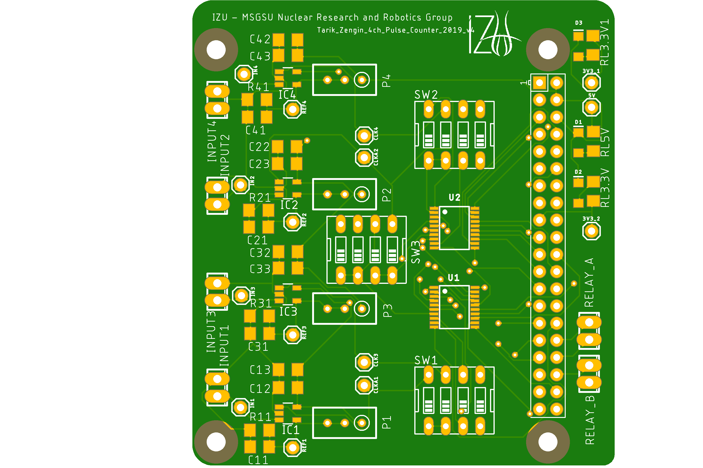

 
# 2/4 channel frequency counter for RPi

Provides 2 32 bits or 4 16 bits independent counters on board.
For the UI software see [this page](https://github.com/atzengin/RPi-Frequency-Counter-Software)

